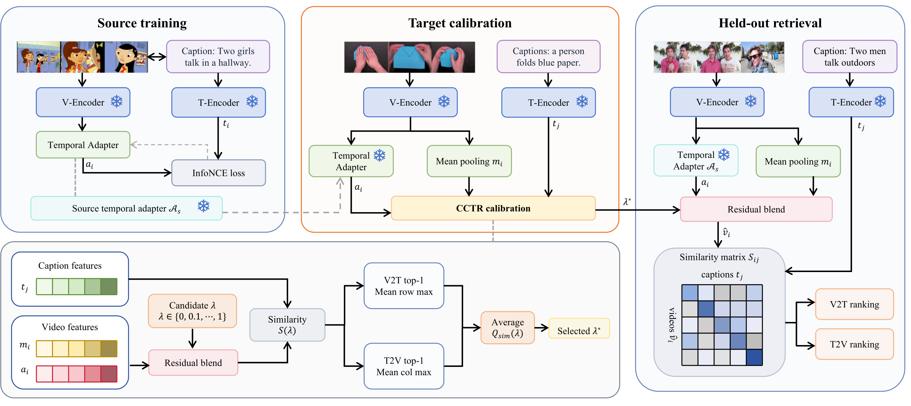

# CCTR: Calibration-Controlled Temporal Residual Transfer

Official implementation of **CCTR**, a label-free deployment rule for transferring a source-trained temporal adapter across video-text retrieval datasets.

Given frozen video and text features, CCTR interpolates between multi-frame mean pooling and a source temporal representation. On an unpaired target calibration bank, it selects a global residual strength \(\lambda^*\) from bidirectional top-one similarity. No target video-caption correspondence, gradient, or target-side parameter update is used during calibration.



## Main result

Frozen OpenCLIP ViT-B/32 held-out R@1 (%). Each entry is `V2T / T2V`, mean +/- sample standard deviation across 3 source seeds and 3 target splits. `MSR` denotes MSR-VTT.

| Transfer | Mean pooling | Full temporal | Cycle | CCTR |
|---|---:|---:|---:|---:|
| MSR -> MSVD | 38.65 +/- 0.17 / 25.17 +/- 1.32 | 43.76 +/- 1.95 / 27.15 +/- 1.05 | 46.48 +/- 1.45 / **27.42 +/- 0.98** | **46.55 +/- 1.40** / 26.58 +/- 1.29 |
| MSR -> VATEX | 61.20 +/- 0.76 / 54.01 +/- 0.19 | 68.34 +/- 1.80 / 55.19 +/- 0.73 | **72.86 +/- 1.12 / 56.90 +/- 0.49** | 72.83 +/- 1.27 / 56.82 +/- 0.53 |
| MSVD -> MSR | 54.89 +/- 0.07 / 36.96 +/- 0.28 | 51.97 +/- 2.07 / 31.10 +/- 0.79 | 63.16 +/- 2.73 / 35.62 +/- 1.17 | **64.34 +/- 1.67 / 37.27 +/- 0.32** |
| VATEX -> MSR | 54.89 +/- 0.07 / 36.96 +/- 0.28 | 61.20 +/- 2.01 / 36.35 +/- 0.52 | 66.55 +/- 1.56 / 37.97 +/- 0.31 | **67.36 +/- 1.26 / 38.30 +/- 0.35** |
| MSVD -> VATEX | 61.20 +/- 0.76 / 54.01 +/- 0.19 | 59.42 +/- 1.30 / 46.56 +/- 0.51 | 68.46 +/- 1.31 / 54.30 +/- 0.64 | **68.52 +/- 1.07 / 54.87 +/- 0.30** |
| VATEX -> MSVD | 38.65 +/- 0.17 / 25.17 +/- 1.32 | 44.78 +/- 2.82 / 24.36 +/- 0.59 | 46.26 +/- 2.16 / 25.45 +/- 0.75 | **46.70 +/- 1.25 / 26.05 +/- 1.02** |

## Temporal adapter controls

Frozen OpenCLIP temporal controls are evaluated on the MSVD held-out test split. Values are V2T / T2V R@1 (%), reported as mean +/- sample standard deviation over three source-training seeds.

| Setting | V2T R@1 | T2V R@1 |
|---|---:|---:|
| Full temporal adapter | 40.10 +/- 0.43 | 29.38 +/- 0.09 |
| Reversed frames | 39.50 +/- 0.60 | 29.16 +/- 0.24 |
| Attention only | 38.01 +/- 5.09 | 28.23 +/- 1.10 |
| Without temporal convolution | 35.82 +/- 0.91 | 29.13 +/- 0.36 |
| Mean pooling, no temporal adapter | 35.07 +/- 0.00 | 21.21 +/- 0.00 |

The configurable ablation implementation is src/dire/configurable_temporal_adapter.py. Training and evaluation use scripts/video/train_temporal_adapter_ablation.py and scripts/video/evaluate_temporal_adapter_ablation.py. The compact released aggregate is results/analysis/openclip_temporal_ablation_summary.json.

## Repository layout

```text
src/dire/                 temporal adapter, feature handling, retrieval metrics, CCTR selector
scripts/data/             MSR-VTT/MSVD/VATEX manifest construction and split checks
scripts/video/            main CCTR path plus reproducible temporal-control ablations
scripts/baselines/        comparison selectors: cycle agreement and source-validation tuning
scripts/analysis/         selector reliability and calibration-budget analyses
tests/                    unit and protocol tests for the released path
results/openclip/         compact primary-result summaries and SHA-256 provenance
results/analysis/         compact summaries for Figure 2, calibration, and temporal controls
assets/figures/           pipeline image used in this README
data/README.md            dataset access and local directory contract
```

## Installation

Python 3.10+ and PyTorch are required. Install the PyTorch build matching your CUDA/CPU environment first, then:

```bash
git clone https://github.com/<YOUR-ACCOUNT>/CCTR.git
cd CCTR
python -m venv .venv
source .venv/bin/activate
pip install --upgrade pip
pip install -e ".[dev]"
```

## Data

The experiments use MSR-VTT, MSVD, and VATEX-English. Raw videos, downloaded annotations, feature caches, and checkpoints are deliberately excluded from Git. See [data/README.md](data/README.md) for the official dataset links and required local layout.

## Main CCTR workflow

The main experiment is deliberately limited to these four scripts:

```bash
scripts/video/extract_frozen_clip_features.py
scripts/video/train_temporal_adapter.py
scripts/video/evaluate_holdout_calibrated_temporal_transfer.py
scripts/analysis/analyze_cctr_holdout_splits.py
```

After building the official dataset manifests, the following is a concrete **MSR-VTT → MSVD** run. Paths are examples and should match your local `data/processed/` directory.

```bash
export RUN_DIR=runs/msr_to_msvd
mkdir -p "$RUN_DIR"

# Frozen frame and text features for source training / source validation.
PYTHONPATH=src python scripts/video/extract_frozen_clip_features.py \
  --manifest data/processed/manifests/msrvtt_train.json \
  --video-dir data/raw/msrvtt/videos \
  --output data/processed/features/msrvtt_train.pt

PYTHONPATH=src python scripts/video/extract_frozen_clip_features.py \
  --manifest data/processed/manifests/msrvtt_dev.json \
  --video-dir data/raw/msrvtt/videos \
  --output data/processed/features/msrvtt_dev.pt

# Train A_s only on paired MSR-VTT source data.
PYTHONPATH=src python scripts/video/train_temporal_adapter.py \
  --train-features data/processed/features/msrvtt_train.pt \
  --dev-features data/processed/features/msrvtt_dev.pt \
  --output "$RUN_DIR/source_adapter.pt" --seed 2027

# Extract disjoint MSVD calibration and held-out feature files, then select lambda on
# the unpaired calibration bank and evaluate once on the held-out bank.
PYTHONPATH=src python scripts/video/evaluate_holdout_calibrated_temporal_transfer.py \
  --calibration-features data/processed/features/msvd_calibration.pt \
  --evaluation-features data/processed/features/msvd_heldout.pt \
  --checkpoint "$RUN_DIR/source_adapter.pt" \
  --output "$RUN_DIR/cctr_report.json" \
  --benchmark "MSR-VTT->MSVD" \
  --protocol-note "Disjoint target calibration and held-out splits; target pair labels hidden during selection."
```

The reported CCTR selector is the mean bidirectional top-one similarity from `dire.temporal_transfer_calibration.unlabelled_retrieval_confidence`; the candidate grid is `{0.0, 0.1, ..., 1.0}`, with ties resolved toward the smaller value.

`scripts/baselines/` contains two comparison protocols that are **not** the main CCTR result: reciprocal cycle agreement and source-validation-tuned residual transfer. They are retained only to reproduce the `Cycle` and source-tuning comparisons in the paper. The scripts under `scripts/analysis/` summarize saved reports and regenerate the calibration analyses.

## Verification

```bash
PYTHONPATH=src python -m pytest -q tests
```

The compact JSON results released under `results/` are sufficient to inspect the reported aggregates and regenerate analysis figures, but they are not a substitute for the original third-party datasets or feature caches.

## Citation

The bibliographic record will be added after the paper is publicly available. Until then, please cite the accompanying manuscript title:

```text
CCTR: Calibration-Controlled Temporal Residual Transfer for Frozen Video-Text Retrieval
```
